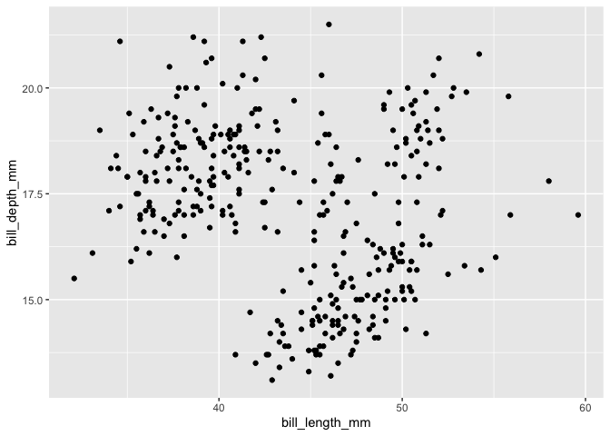

Debugging R
================

# Bug 1 - Could not find function “ggplot”

``` r
# load libraries ----

library(palmerpenguins) # loaded for penguins data

# visualise data ----

ggplot(data = penguins, 
       mapping = aes(x = bill_length_mm, 
                     y = bill_depth_mm)) +
  geom_point()
```

    ## Error in ggplot(data = penguins, mapping = aes(x = bill_length_mm, y = bill_depth_mm)): could not find function "ggplot"

## Follow these steps

-   Step 1: Stay calm
-   Step 2: Read the error message carefully and look out for helpful
    advice
-   Step 3: If the advice was not helpful, use a search engine of your
    choice and type:

> “could not find function”ggplot" error R tidyverse"

## Possible issues

You have two possible issues here:

1.  The function you have called doesn’t exist (you have made a spelling
    mistake)
2.  The R package that contains the function is not loaded

## Solution

In this case, you are facing the second issue. The R Package that
contains the function `ggplot()` is not loaded. The function is part of
the `{ggplot2}` Package. To load it, write `library(ggplot2)` into your
script before you execute the function `ggplot()` is not loaded

``` r
# load libraries ----

library(palmerpenguins)
library(ggplot2)

# visualise data ----

ggplot(penguins, aes(x = bill_length_mm, y = bill_depth_mm)) +
  geom_point()
```

    ## Warning: Removed 2 rows containing missing values (geom_point).

<!-- -->

# Bug 1 - There is no package called ‘skimr’

``` r
library(skimr)
```

## Follow these steps

-   Step 1: Stay calm
-   Step 2: Read the error message carefully and look out for helpful
    advice
-   Step 3: If the advice was not helpful, use a search engine of your
    choice and type:

> “Error in library(skimr) : there is no package called ‘skimr’”

## Possible issues

1.  The R package you have called doesn’t exist (you have made a
    spelling mistake)
2.  The R package is not installed

## Solution

In this case, you are facing the second issue. The R Package `{skimr}`
is not installed. To install it, call `install.packages("skimr")` in
your **Console**. Do this in your Console because you only need to
install it once. After you have installed it, call it with
`library(skimr)`

``` r
# load libraries ----

library(skimr)
library(palmerpenguins)

# explore data ----

skim(penguins)
```

|                                                  |          |
|:-------------------------------------------------|:---------|
| Name                                             | penguins |
| Number of rows                                   | 344      |
| Number of columns                                | 8        |
| \_\_\_\_\_\_\_\_\_\_\_\_\_\_\_\_\_\_\_\_\_\_\_   |          |
| Column type frequency:                           |          |
| factor                                           | 3        |
| numeric                                          | 5        |
| \_\_\_\_\_\_\_\_\_\_\_\_\_\_\_\_\_\_\_\_\_\_\_\_ |          |
| Group variables                                  | None     |

Data summary

**Variable type: factor**

| skim\_variable | n\_missing | complete\_rate | ordered | n\_unique | top\_counts                 |
|:---------------|-----------:|---------------:|:--------|----------:|:----------------------------|
| species        |          0 |           1.00 | FALSE   |         3 | Ade: 152, Gen: 124, Chi: 68 |
| island         |          0 |           1.00 | FALSE   |         3 | Bis: 168, Dre: 124, Tor: 52 |
| sex            |         11 |           0.97 | FALSE   |         2 | mal: 168, fem: 165          |

**Variable type: numeric**

| skim\_variable      | n\_missing | complete\_rate |    mean |     sd |     p0 |     p25 |     p50 |    p75 |   p100 | hist  |
|:--------------------|-----------:|---------------:|--------:|-------:|-------:|--------:|--------:|-------:|-------:|:------|
| bill\_length\_mm    |          2 |           0.99 |   43.92 |   5.46 |   32.1 |   39.23 |   44.45 |   48.5 |   59.6 | ▃▇▇▆▁ |
| bill\_depth\_mm     |          2 |           0.99 |   17.15 |   1.97 |   13.1 |   15.60 |   17.30 |   18.7 |   21.5 | ▅▅▇▇▂ |
| flipper\_length\_mm |          2 |           0.99 |  200.92 |  14.06 |  172.0 |  190.00 |  197.00 |  213.0 |  231.0 | ▂▇▃▅▂ |
| body\_mass\_g       |          2 |           0.99 | 4201.75 | 801.95 | 2700.0 | 3550.00 | 4050.00 | 4750.0 | 6300.0 | ▃▇▆▃▂ |
| year                |          0 |           1.00 | 2008.03 |   0.82 | 2007.0 | 2007.00 | 2008.00 | 2009.0 | 2009.0 | ▇▁▇▁▇ |
