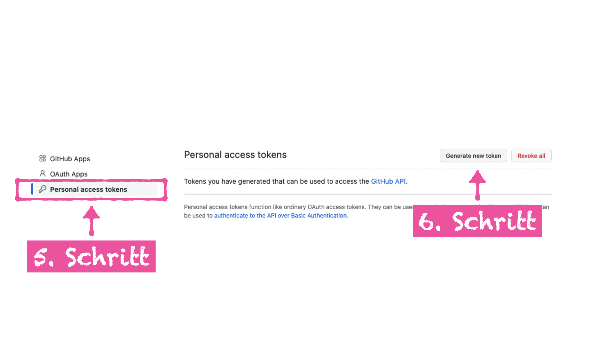
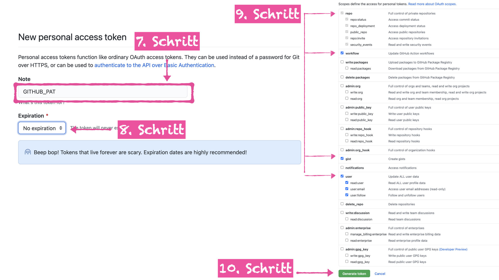
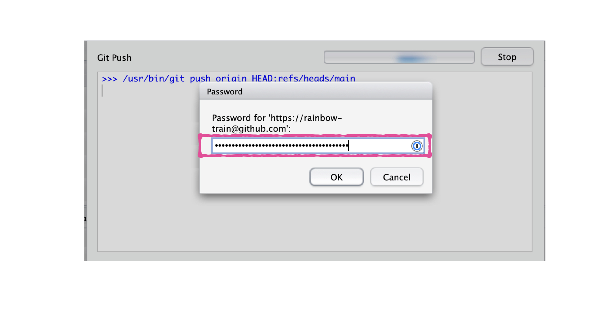

Seit dem 13. August 2021 erlaubt GitHub für die Authentifizierung mit externen Applikationen (RStudio IDE) nur noch die Nutzung eines Personal Access Token (PAT). Dieser PAT wird anstelle des GitHub Passwortes genutzt, welches für die gewöhnliche Anmeldung im Browser bestehen bleibt. 

Folgend sind die Schritte um deinen PAT zu erstellen:

1. Öffne www.github.com und login mit deinen Nutzerdetails
2. Klick auf dein Profil oben rechts
3. Im Dropbown Menü, klick auf "Settings". Es öffnet sich eine neue Ansicht.
4. In der Auswahlliste links, scrolle hinunter bis ans Ende und klick auf "Developer settings". Es öffnet sich eine neue Ansicht.

5. In der Auswahlliste links, klick auf "Personal access token"
6. Klick auf "Generate new token"

7. Im Feld "Note" schreibe: GITHUB_PAT
8. Unter "Experiation", selektiere: No expriation
9. Scrolle hinunter to "Select Scopes", und setze ein Häkchen bei:
    - repo
    - workflow
    - gist
    - user
10. Klick auf "Generate token"

11. Kopiere den angezeigten PAT und speicher diesen an einem sicheren Ort (z.B. Passwort Manager)

Das nächste Mal wenn du einen "push" in RStudio ausführst und nach deinem Benutzerdaten gefragt wirst, nutze diesen GitHub Personal access token (PAT) anstatt deines Passworts. 

