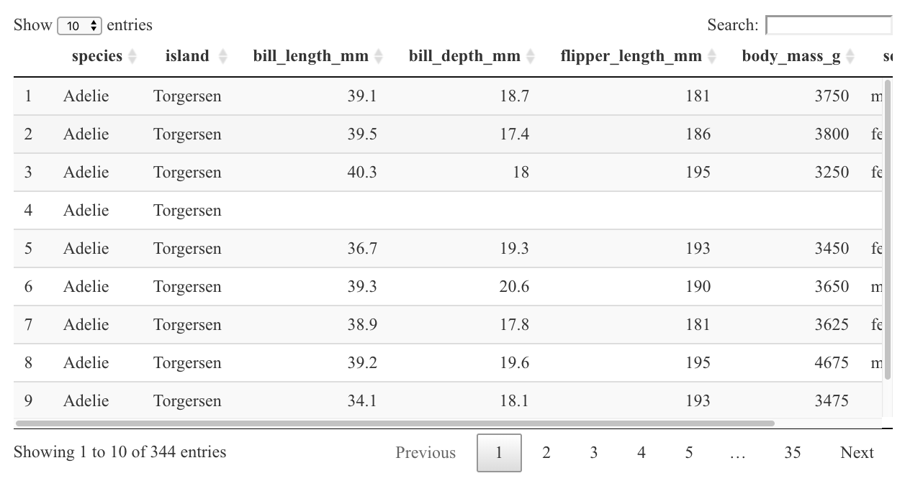

Tabellen darstellen
================

# Hintergrund

## knitr::kable() - Nützlich für verschiedene Outputs

Wenn der Output des Codes als einfache statische Tabelle dargestellt
werden soll, empfehle ich die `kable()` Funktion as dem `{knitr}`
Package. Das Package ist mit grosser Warscheinlichkeit schon
installiert, falls nicht:

-   `install.packages("knitr")` einmalig in der Console ausführen

Die Funktion eignet sich vor Allem bei kleineren Tabellen die komplett
dargestellt werden sollen, wie zum Beispiel einer Zusammenfassung
(Häufigkeitstabelle).

Anwendungsbeispiel:

``` r
# Lade Packages

library(palmerpenguins)
library(dplyr)
library(knitr)

# Häufigkeitstabelle mit kable() Funktion

penguins %>% 
  count(species, island) %>%  # Dieser Code erstellt eine Häufigkeitstabelle
  kable()
```

| species   | island    |   n |
|:----------|:----------|----:|
| Adelie    | Biscoe    |  44 |
| Adelie    | Dream     |  56 |
| Adelie    | Torgersen |  52 |
| Chinstrap | Dream     |  68 |
| Gentoo    | Biscoe    | 124 |

Die Funktion `kable()` kann direkt mit der Pipe an das Ende der Code
Sequenz gesetzt werden um den Output an dieser Stelle als Tabelle
darzustellen.

## gt::gt() - hohes Anpassungspotential

Wenn der Output des Codes als komplexe statische Tabelle dargestellt
werden soll, empfehle ich die `gt()` Funktion as dem dem gleichnamigen
`{gt}` Package. Das Package wird folgendermassen installiert:

-   `install.packages("gt")` einmalig in der Console ausführen

Die Funktion eignet sich vor Allem bei Tabellen welche mit hoher
Anschaulichkeit dargestellt werden sollen. Es bietet eine sehr grosses
Anpassungspotential und ist von der Grammatik gut nachzuvollziehen.
Zusätzlich hat das Package eine sehr nützliche Dokumentation.

Bei diesem Package empfehle sich mit der Dokumentation
auseinanderzusetzen:

-   <https://gt.rstudio.com/>
-   <https://gt.rstudio.com/articles/gt-datasets.html>

Um das Package direkt mit Beispielen auszuprobieren, gibt es ein RStudio
Cloud Project welches genutzt werden kann:

-   <https://rstudio.cloud/project/779965>

Anwendungsbeispiel (einfach):

``` r
library(gt)

penguins %>% 
  count(species, island) %>%  # Dieser Code erstellt eine Häufigkeitstabelle
  gt()
```

<div id="orwcbahafn" style="overflow-x:auto;overflow-y:auto;width:auto;height:auto;"><table class="gt_table">
  
  <thead class="gt_col_headings">
    <tr>
      <th class="gt_col_heading gt_columns_bottom_border gt_center" rowspan="1" colspan="1">species</th>
      <th class="gt_col_heading gt_columns_bottom_border gt_center" rowspan="1" colspan="1">island</th>
      <th class="gt_col_heading gt_columns_bottom_border gt_center" rowspan="1" colspan="1">n</th>
    </tr>
  </thead>
  <tbody class="gt_table_body">
    <tr>
      <td class="gt_row gt_center">Adelie</td>
      <td class="gt_row gt_center">Biscoe</td>
      <td class="gt_row gt_center">44</td>
    </tr>
    <tr>
      <td class="gt_row gt_center">Adelie</td>
      <td class="gt_row gt_center">Dream</td>
      <td class="gt_row gt_center">56</td>
    </tr>
    <tr>
      <td class="gt_row gt_center">Adelie</td>
      <td class="gt_row gt_center">Torgersen</td>
      <td class="gt_row gt_center">52</td>
    </tr>
    <tr>
      <td class="gt_row gt_center">Chinstrap</td>
      <td class="gt_row gt_center">Dream</td>
      <td class="gt_row gt_center">68</td>
    </tr>
    <tr>
      <td class="gt_row gt_center">Gentoo</td>
      <td class="gt_row gt_center">Biscoe</td>
      <td class="gt_row gt_center">124</td>
    </tr>
  </tbody>
  
  
</table></div>

## DT::DT() - Beispiel läuft nur in HTML Output

Wenn der Output des Codes als interaktive Tabelle dargestellt werden
soll, empfehle ich die `datatable()` Funktion aus dem `{DT}` Package.
Das Package wird folgendermassen installiert:

-   `install.packages("DT")` einmalig der Console ausführen

Die Tabelle eignet sich sehr gut bei grösseren Tabellen, mit welchen
interaktiv im Dokument gearbeitet werden kann um die Daten zu erkunden.

Die Dokumentation des Packages befindet sich auf der folgenden Webseite:
<https://rstudio.github.io/DT/>

Anwendungsbeispiel (Achtung: Nur Screenshot hier)

``` r
library(DT)

# Häufigkeitstabelle mit DT() Funktion

penguins %>% 
  datatable()
```



## Weitere Packages

Dies sind nur drei einer grossen Anzahl an Packages um Tabellen in R
darzustellen. Hier noch eine unvollständige Liste:

-   [{flextable}](https://davidgohel.github.io/flextable/)
-   [{kableExtra}](https://haozhu233.github.io/kableExtra/)
-   [{reactable}](https://glin.github.io/reactable/index.html)
-   [{huxtable}](https://hughjonesd.github.io/huxtable/huxtable.html)
